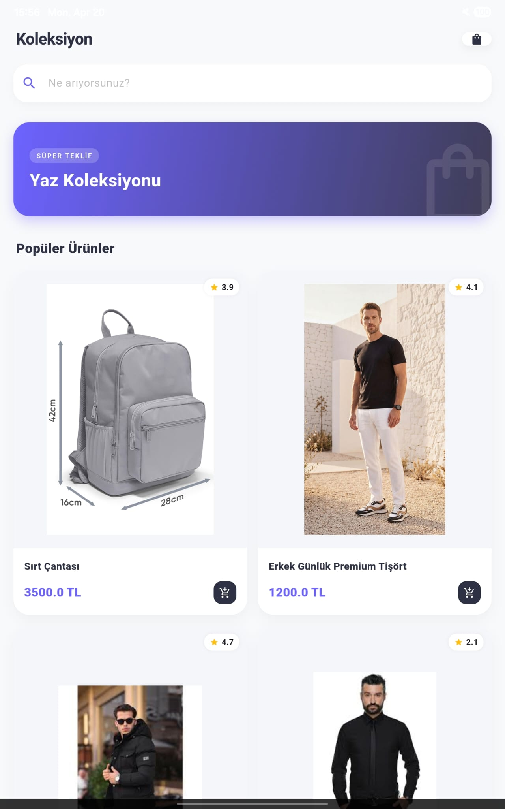
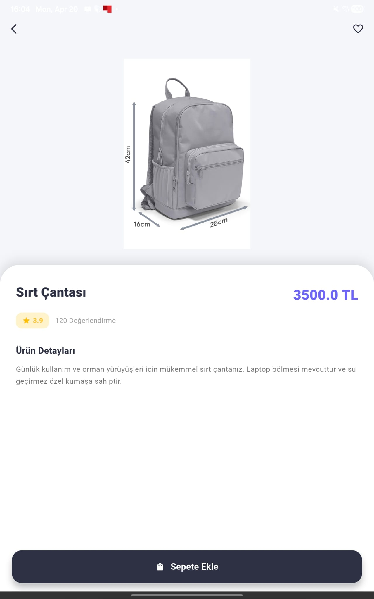
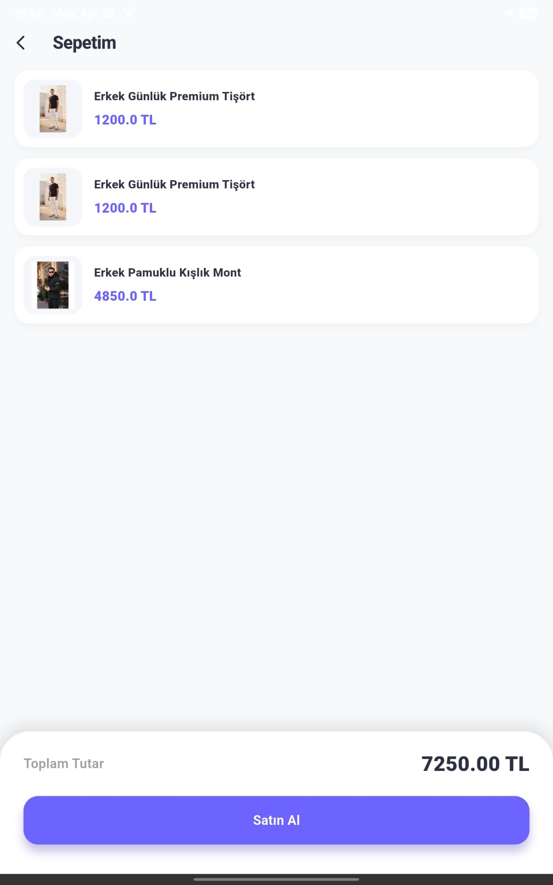

# Mini Katalog Uygulaması

## Kısa Açıklama
Bu proje, Flutter Günlük Eğitim Programı kapsamında geliştirilmiş olan temel seviye bir **Mini Katalog Uygulamasıdır**. Proje içerisinde temel Flutter SDK özellikleri, Stateless/Stateful widget mimarisi, navigator ile sayfa geçişleri, dummy verilerle JSON modelleme (Product modeli) kullanımı uygulamalı olarak geliştirilmiştir. Hiçbir harici paket (statemanagement, http vb.) kullanılmadan, sadece `material.dart` altyapısı ile modern ve profesyonel bir UI tasarlanmıştır.

## Özellikler ve Öğrenim Çıktıları
- **Widget Ağacı ve UI:** Temel widget'lar (Container, Row, Column, Expanded, Padding vb.) ile sıfırdan tasarım çıkarıldı.
- **Navigasyon:** Sayfalar arası geçişlerde (`Navigator.push`, `Navigator.pop`) objeler üzerinden veri taşıma yapıldı.
- **JSON & Data Modelleme:** Dışarıdan geliyormuş gibi planlanan veriler için bir `Product` model sınıfı ve `fromJson` metodu oluşturuldu.
- **Listeleme:** Ürünleri sergilemek için `GridView` (`SliverGrid`) ve `ListView` yapıları kullanıldı.
- **Sepet Simülasyonu:** Local bir liste üzerinden Stateful widget yardımıyla sepete ürün ekleme ve sayacı güncelleme simülasyonu yapıldı.

## Kullanılan Sürüm
- **Flutter Sürümü:** 3.19.0 (veya ilgili güncel 3.x sürümü)
- **Dart Sürümü:** 3.3.0 (veya ilgili güncel 3.x sürümü)

## Çalıştırma Adımları
Projeyi kendi ortamınızda test etmek için aşağıdaki adımları izleyebilirsiniz:

1. Projeyi sisteminize indirin.
2. Proje kök dizininde bir terminal veya komut satırı açın.
3. Paketleri indirmek için:
   ```bash
   flutter pub get
   ```
4. Uygulamayı bağlı bir telefon veya emülatörde ayağa kaldırmak için:
   ```bash
   flutter run
   ```

## Ekran Görüntüleri (Screenshots)


| Koleksiyon Ana Sayfası | Ürün Detay Sayfası | Sepet Sayfası |
|:---:|:---:|:---:|
|  |  |  |
